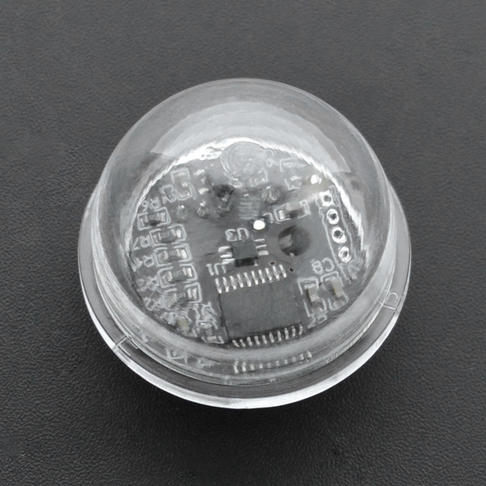

# DFRobot_B_LUX_V30B
- [中文版](./README_CN.md)

This new ambient light sensor is packaged in a transparent semisphere case that offers better light gathering power. The sensor supports 0-200klx detection range and I2C communication. The on-chip photodiode’s spectral response is optimized to mimic the human eye’s perception of ambient light and incorporates IR and UV blocking capability. The adaptive gain block automatically selects the correct lux range to optimize the counts/lux. It is ideal for applications such as smartphones, vehicle smart light, intelligent incubator, etc.



## Product Link (https://www.dfrobot.com/product-2183.html)
    SKU :SEN0390

## Table of Contents

* [Installation](#installation)
* [Methods](#methods)
* [Compatibility](#compatibility)
* [History](#history)
* [Credits](#credits)

## Summary
- This is a sensor that gets the intensity of light.
- It uses IIC to transmit the collected data, and its IIC address cannot be changed.
- You can write the desired configuration to the configuration register(address:0x04), setting different acquisition accuracy.
- You can read the light intensity data from the data register(address:0x00~0x03).

## Installation

To use this library, first download the library file, paste it into the \Arduino\libraries directory, then open the examples folder and run the demo in the folder.

## Methods

```C++
  /**
   * @brief The constructor
   * @param cEN Optional pin
   * @param scl Clock line, specified by default as SCL
   * @param sda Data line, specified by default as SCL
   */
  DFRobot_B_LUX_V30B(uint8_t cEN, uint8_t scl = SCL, uint8_t sda = SDA);
/**
   * @brief The destructor
   */
  ~DFRobot_B_LUX_V30B(){
  };
  /**
   * @brief Initialization function
   */
  void begin(void);
  /**
   * @brief Get the intensity of light.
   * @return Returns the obtained light intensity value on success and -1 on failure
   */
  float lightStrengthLux(void);
  /**
   * @brief Set the acquisition mode of the sensor
   * @param mode Patterns that need to be configured
   * @return Returns 1 on success and -1 on failure
   */
  uint8_t setMode(uint8_t isManualMode=0,uint8_t isCDR=0,uint8_t isTime=0);
  /**
   * @brief Get the acquisition mode of the sensor
   * @return Current sensor acquisition mode
   */
  uint8_t readMode(void);
  
```

## Compatibility

| MCU           | Work Well | Work Wrong | Untested | Remarks |
| ------------- | :-------: | :--------: | :------: | ------- |
| Arduino uno   |     √     |            |          |         |
| Mega2560      |     √     |            |          |         |
| ESP32         |     √     |            |          |         |


## History

- data 2020-12-03
- version V1.0


## Credits

Written by yangfeng(feng.yang@dfrobot.com), 2020. (Welcome to our [website](https://www.dfrobot.com/))

